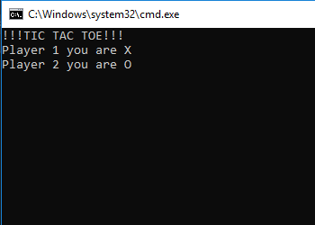
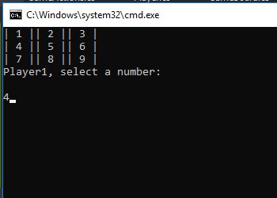
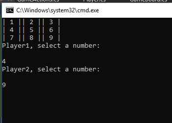

# Lab04 Tic Tac Toe
Tic Tac Toe implements the concepts of C# classes and objects

## Dependencies
This game runs on .NET Core 2.1, which can be downloaded [here](https://www.microsoft.com/net/download/macos).

---
## Build
After installing the [.NET Core 2.1 SDK](https://www.microsoft.com/net/download/macos), clone this repo onto your machine. From a terminal interface, go to where this was cloned and type the following commands:

```
cd Lab04_Tic_Tac_Toe
dotnet restore
dotnet run
```
---
## Concepts Implemented
This game implements C# classes and objects in order 
to create an interactive 2 player tic tac toe game.

---
## How to Use the Program
The program will automatically assign an X marker to player 1
and an O marker to player 2.
The board will then be displayed.
The 1st player will select where to go 
by entering the number of the square.
The 2nd player will select where to go after player 1.
This process will repeat.

---

## Screenshot Walk Through
1: Player1 and Player2 will be given a marker each



2: Player1 chooses where to go first



3: Player2 goes next


